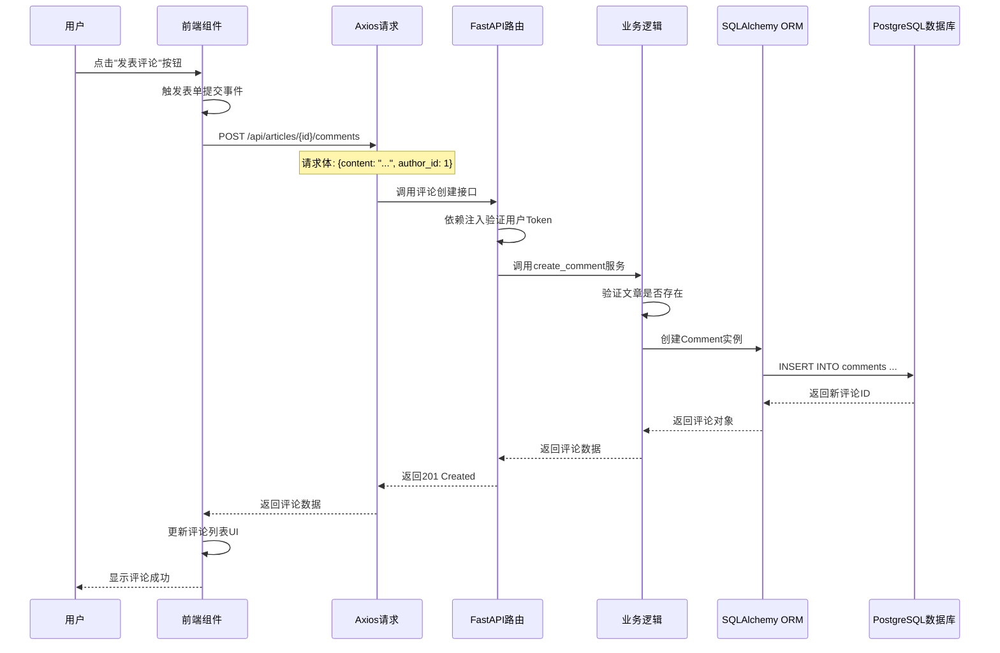

# Blog System 架构分析报告

## 一、评论功能调用链路分析

### 重要说明
经过对 `frontend-web` 前端代码和 `backend` 后端代码的全面检查，**本项目当前未实现评论功能**。具体证据如下：

1. **前端**：`ArticleDetail.vue`（文章详情页）仅包含文章内容展示，无评论表单、评论列表等组件
2. **后端 API**：`articles.py` 路由中只有文章的 CRUD 接口，无评论相关接口
3. **数据库模型**：`models/article.py` 中未定义 `Comment` 模型，也无评论相关外键
4. **全局搜索**：在整个代码库中搜索 "comment" 或 "评论" 关键词无任何匹配结果

因此，无法梳理用户点击"发表评论"到数据入库的调用链路。若需要实现该功能，可参考以下典型博客系统评论链路设计：



**假设的数据表设计**：
- 表名：`comments`
- 字段：`id` (PK), `content` (TEXT), `article_id` (FK), `author_id` (FK), `created_at`, `updated_at`

---

## 二、JWT 认证安全隐患分析

### 核心代码位置
- `backend/app/core/security.py`
- `backend/app/core/config.py`

### 安全隐患 1：密钥管理硬编码且强度不足

**问题描述**：
```python
# config.py:12
SECRET_KEY: str = "your-super-secret-key-change-in-production"
```
- 密钥硬编码在配置文件中，默认值过于简单且存在于代码仓库
- 未强制要求生产环境必须修改，存在被泄露的风险
- 无密钥轮换机制，一旦泄露无法快速失效所有 Token

**修复方案**：
1. 使用环境变量注入密钥，禁止硬编码
2. 生成高强度随机密钥（推荐 32 字节以上）
3. 实现密钥版本控制和轮换机制

```python
# 修复后的 config.py
from pydantic_settings import BaseSettings, Field
import os

class Settings(BaseSettings):
    SECRET_KEY: str = Field(..., env="SECRET_KEY")
    PREVIOUS_SECRET_KEY: str | None = Field(None, env="PREVIOUS_SECRET_KEY")  # 用于密钥轮换
    JWT_KEY_VERSION: int = 1  # 密钥版本号
    
    class Config:
        env_file = ".env"

# 修复后的 security.py - 支持多密钥验证
def decode_token(token: str) -> dict:
    exceptions = []
    # 优先使用当前密钥，失败后尝试旧密钥（用于平滑轮换）
    for key in [settings.SECRET_KEY, settings.PREVIOUS_SECRET_KEY]:
        if not key:
            continue
        try:
            payload = jwt.decode(token, key, algorithms=[settings.ALGORITHM])
            return payload
        except JWTError as e:
            exceptions.append(e)
    raise exceptions[0] if exceptions else JWTError("Invalid token")
```

---

### 安全隐患 2：缺少 Token 刷新机制和并发登录控制

**问题描述**：
```python
# security.py:27-35
def create_access_token(data: dict, expires_delta: Optional[timedelta] = None) -> str:
    to_encode = data.copy()
    if expires_delta:
        expire = datetime.utcnow() + expires_delta
    else:
        expire = datetime.utcnow() + timedelta(minutes=settings.ACCESS_TOKEN_EXPIRE_MINUTES)
    to_encode.update({"exp": expire})
    encoded_jwt = jwt.encode(to_encode, settings.SECRET_KEY, algorithm=settings.ALGORITHM)
    return encoded_jwt
```
- 只有 Access Token，无 Refresh Token 机制
- Token 有效期长达 7 天（`ACCESS_TOKEN_EXPIRE_MINUTES: int = 60 * 24 * 7`），增加泄露风险
- 无 Token 黑名单机制，用户无法主动注销已签发的 Token
- 无并发登录限制，同一账号可在多设备无限登录
- 无 Token 版本控制，修改密码后旧 Token 仍然有效

**修复方案**：

1. **实现 Refresh Token 机制**：
```python
# models/user.py - 新增 RefreshToken 模型
class RefreshToken(Base):
    __tablename__ = "refresh_tokens"
    
    id = Column(Integer, primary_key=True)
    user_id = Column(Integer, ForeignKey("users.id", ondelete="CASCADE"))
    token = Column(String(255), unique=True, nullable=False)
    expires_at = Column(DateTime, nullable=False)
    created_at = Column(DateTime, default=datetime.utcnow)
    revoked = Column(Boolean, default=False)
    
    user = relationship("User", back_populates="refresh_tokens")

# security.py - 新增函数
def create_refresh_token(user_id: int) -> tuple[str, datetime]:
    expires_delta = timedelta(days=30)
    expire = datetime.utcnow() + expires_delta
    token = secrets.token_urlsafe(64)  # 生成随机 Refresh Token
    return token, expire

async def rotate_refresh_token(db: AsyncSession, old_token: str, user_id: int) -> tuple[str, datetime]:
    # 作废旧 Token
    result = await db.execute(
        select(RefreshToken).where(RefreshToken.token == old_token)
    )
    old_refresh = result.scalar_one_or_none()
    if old_refresh:
        old_refresh.revoked = True
    
    # 生成新 Token
    new_token, new_expire = create_refresh_token(user_id)
    db.add(RefreshToken(
        user_id=user_id,
        token=new_token,
        expires_at=new_expire
    ))
    await db.flush()
    return new_token, new_expire
```

2. **实现 Token 黑名单和并发控制**：
```python
# security.py - 新增 Token 验证增强
from app.models.user import RefreshToken, TokenBlacklist

async def get_current_user(
    credentials: HTTPAuthorizationCredentials = Depends(security),
    db: AsyncSession = Depends(get_db)
) -> User:
    # ... 原有解码逻辑 ...
    
    # 检查 Token 是否在黑名单中（用户主动登出、修改密码等场景）
    result = await db.execute(
        select(TokenBlacklist).where(TokenBlacklist.token == token)
    )
    if result.scalar_one_or_none():
        raise credentials_exception
    
    # 检查用户是否修改过密码（Token 版本验证）
    if "password_version" in payload and payload["password_version"] != user.password_version:
        raise credentials_exception
    
    return user

# 登出接口 - 将 Token 加入黑名单
@router.post("/auth/logout")
async def logout(
    credentials: HTTPAuthorizationCredentials = Depends(security),
    db: AsyncSession = Depends(get_db)
):
    db.add(TokenBlacklist(
        token=credentials.credentials,
        expires_at=datetime.fromtimestamp(payload["exp"])
    ))
    await db.flush()
    return {"message": "登出成功"}
```

3. **缩短 Access Token 有效期**：
```python
# config.py
ACCESS_TOKEN_EXPIRE_MINUTES: int = 15  # 改为 15 分钟
REFRESH_TOKEN_EXPIRE_DAYS: int = 7     # Refresh Token 7 天
MAX_ACTIVE_SESSIONS: int = 5           # 最大并发登录数
```

---

### 安全隐患 3：CORS 配置过于宽松

**问题描述**：
```python
# config.py:22
CORS_ORIGINS: str = "*"
```
- 默认允许所有来源跨域访问，增加 CSRF 攻击风险

**修复方案**：
```python
# config.py
CORS_ORIGINS: str = Field(
    "https://your-blog.com,https://admin.your-blog.com",
    env="CORS_ORIGINS",
    description="逗号分隔的允许跨域域名"
)
```

---

## 三、前端代码复用分析与 Monorepo 改造方案

### 当前重复实现分析

#### 1. API 封装层（重复度：90%）
两个项目都有独立的 `src/api/index.ts`，包含：
- **重复的 Axios 实例配置**：baseURL、timeout、headers 完全相同
- **重复的请求/响应拦截器**：Token 注入逻辑、401 重定向逻辑高度相似
- **重复的类型定义**：`User`, `Article`, `Category`, `Tag`, `PaginatedResponse`, `SiteSettings` 完全相同
- **重复的错误处理**：`getErrorMessage`, `ERROR_MESSAGES`, `HTTP_STATUS_MESSAGES` 几乎一致

**差异点**：
- `frontend-web` 使用 `token` 作为 localStorage key，`frontend-admin` 使用 `admin_token`
- `frontend-admin` 有更多 API 端点（CRUD 完整），`frontend-web` 只有查询接口

#### 2. 状态管理（重复度：85%）
两个项目都有 `src/stores/user.ts`：
- 相同的 Pinia Store 结构（user, token, isLoggedIn 状态）
- 相同的 login/register/fetchUser/logout 方法
- 相同的 Token 持久化逻辑（localStorage）

#### 3. 工具函数（重复度：95%）
- 日期格式化（均依赖 `date-fns`）
- 错误消息处理
- 类型判断函数

#### 4. 配置文件（重复度：80%）
- `vite.config.ts`：几乎完全相同
- `tsconfig.json`：完全相同
- `tailwind.config.js`：主题配置高度相似
- `postcss.config.js`：完全相同

#### 5. 依赖版本（重复度：90%）
两个项目的 `package.json` 中大部分依赖版本相同：
- Vue 3.4.21
- Pinia 2.1.7
- Naive UI 2.38.1
- Axios 1.6.8
- Vite 5.2.8
- TypeScript 5.4.3
- Tailwind CSS 3.4.3

---

### Monorepo 改造方案（npm workspaces）

#### 目录结构设计
```
lable-01632/
├── backend/                    # 保持不变
├── frontend/                   # 前端 monorepo 根目录
│   ├── package.json            # 根 package.json，定义 workspaces
│   ├── tsconfig.base.json      # 共享 TypeScript 配置
│   ├── .prettierrc             # 共享代码风格配置
│   ├── .eslintrc.js            # 共享 ESLint 配置
│   ├── packages/
│   │   ├── shared/             # 共享代码包
│   │   │   ├── src/
│   │   │   │   ├── api/        # 共享 API 封装
│   │   │   │   │   ├── client.ts        # Axios 实例工厂
│   │   │   │   │   ├── types.ts         # 共享类型定义
│   │   │   │   │   ├── errors.ts        # 错误处理
│   │   │   │   │   └── endpoints/       # API 端点定义
│   │   │   │   │       ├── auth.ts
│   │   │   │   │       ├── articles.ts
│   │   │   │   │       ├── categories.ts
│   │   │   │   │       ├── tags.ts
│   │   │   │   │       ├── users.ts
│   │   │   │   │       └── settings.ts
│   │   │   │   ├── store/        # 共享状态管理
│   │   │   │   │   └── useUserStore.ts
│   │   │   │   ├── utils/        # 共享工具函数
│   │   │   │   │   ├── format.ts
│   │   │   │   │   └── validators.ts
│   │   │   │   └── components/   # 共享 UI 组件
│   │   │   ├── package.json
│   │   │   └── tsconfig.json
│   │   │
│   │   ├── ui-kit/           # UI 组件库（可选，后续扩展）
│   │   │   ├── src/
│   │   │   └── package.json
│   │   │
│   │   └── config/           # 共享配置
│   │       ├── tailwind.config.base.js
│   │       ├── vite.config.base.ts
│   │       └── package.json
│   │
│   └── apps/
│       ├── web/              # 原 frontend-web
│       │   ├── src/
│       │   │   ├── router/
│       │   │   ├── views/
│       │   │   ├── layouts/
│       │   │   └── main.ts
│       │   ├── package.json
│       │   ├── vite.config.ts
│       │   └── tailwind.config.js
│       │
│       └── admin/            # 原 frontend-admin
│           ├── src/
│           │   ├── router/
│           │   ├── views/
│           │   ├── layouts/
│           │   └── main.ts
│           ├── package.json
│           ├── vite.config.ts
│           └── tailwind.config.js
│
├── docker-compose.yml
└── README.md
```

---

#### 根 package.json 配置
```json
{
  "name": "blog-frontend-monorepo",
  "version": "1.0.0",
  "private": true,
  "workspaces": [
    "apps/*",
    "packages/*"
  ],
  "scripts": {
    "dev:web": "npm run dev -w @blog/web",
    "dev:admin": "npm run dev -w @blog/admin",
    "dev": "concurrently \"npm:dev:web\" \"npm:dev:admin\"",
    "build:web": "npm run build -w @blog/web",
    "build:admin": "npm run build -w @blog/admin",
    "build": "npm run build:shared && npm run build:web && npm run build:admin",
    "build:shared": "npm run build -w @blog/shared",
    "lint": "eslint . --ext .vue,.ts,.tsx",
    "typecheck": "npm run typecheck -w @blog/web && npm run typecheck -w @blog/admin"
  },
  "devDependencies": {
    "concurrently": "^8.2.2",
    "typescript": "^5.4.3"
  }
}
```

---

#### 共享包 package.json 配置（packages/shared/package.json）
```json
{
  "name": "@blog/shared",
  "version": "1.0.0",
  "type": "module",
  "main": "./dist/index.js",
  "types": "./dist/index.d.ts",
  "exports": {
    ".": "./src/index.ts",
    "./api": "./src/api/index.ts",
    "./types": "./src/api/types.ts",
    "./store": "./src/store/index.ts",
    "./utils": "./src/utils/index.ts"
  },
  "scripts": {
    "build": "tsc -p tsconfig.json",
    "dev": "tsc -p tsconfig.json --watch"
  },
  "dependencies": {
    "axios": "^1.6.8",
    "pinia": "^2.1.7",
    "vue": "^3.4.21"
  },
  "devDependencies": {
    "typescript": "^5.4.3"
  }
}
```

---

#### 应用层 package.json 配置（apps/web/package.json）
```json
{
  "name": "@blog/web",
  "version": "1.0.0",
  "private": true,
  "type": "module",
  "scripts": {
    "dev": "vite",
    "build": "vue-tsc && vite build",
    "preview": "vite preview",
    "typecheck": "vue-tsc --noEmit"
  },
  "dependencies": {
    "@blog/shared": "*",
    "vue": "^3.4.21",
    "vue-router": "^4.3.0",
    "naive-ui": "^2.38.1",
    "@vicons/ionicons5": "^0.12.0",
    "marked": "^12.0.1"
  },
  "devDependencies": {
    "@vitejs/plugin-vue": "^5.0.4",
    "typescript": "^5.4.3",
    "vite": "^5.2.8",
    "vue-tsc": "^2.0.7"
  }
}
```

---

#### 共享 API 封装示例（packages/shared/src/api/client.ts）
```typescript
import axios, { AxiosInstance } from 'axios'

export interface ApiClientConfig {
  baseURL: string
  tokenKey: string
  timeout?: number
}

export function createApiClient(config: ApiClientConfig): AxiosInstance {
  const api = axios.create({
    baseURL: config.baseURL,
    timeout: config.timeout || 10000,
    headers: {
      'Content-Type': 'application/json'
    }
  })

  api.interceptors.request.use((config) => {
    const token = localStorage.getItem(config.tokenKey)
    if (token) {
      config.headers.Authorization = `Bearer ${token}`
    }
    return config
  })

  api.interceptors.response.use(
    (response) => response.data,
    (error) => {
      if (error.response?.status === 401) {
        localStorage.removeItem(config.tokenKey)
        if (!window.location.pathname.includes('/login')) {
          window.location.href = '/login'
        }
      }
      return Promise.reject(error)
    }
  )

  return api
}
```

---

#### 共享类型定义（packages/shared/src/api/types.ts）
```typescript
export interface User {
  id: number
  username: string
  email: string
  role: 'admin' | 'user'
  avatar?: string
  created_at: string
}

export interface Article {
  id: number
  title: string
  slug: string
  summary: string
  content: string
  cover_image?: string
  category_id: number
  category?: Category
  tags: Tag[]
  author: User
  views: number
  status: 'draft' | 'published'
  created_at: string
  updated_at: string
}

export interface Category {
  id: number
  name: string
  slug: string
  description?: string
  article_count?: number
}

export interface Tag {
  id: number
  name: string
  slug: string
  color?: string
  article_count?: number
}

export interface PaginatedResponse<T> {
  items: T[]
  total: number
  page: number
  page_size: number
  pages: number
}

export interface SiteSettings {
  site_name: string
  site_description: string
  site_keywords: string
  author_name: string
  author_bio: string
  author_avatar: string
  github_url: string
  email: string
}

export interface ApiError {
  error: boolean
  error_code: string
  detail: string
  path?: string
}
```

---

#### 共享 User Store（packages/shared/src/store/useUserStore.ts）
```typescript
import { defineStore } from 'pinia'
import { ref, computed } from 'vue'
import { authApi, type User, getErrorMessage } from '@blog/shared/api'

export interface UserStoreConfig {
  tokenKey: string
}

export function createUserStore(config: UserStoreConfig) {
  return defineStore('user', () => {
    const user = ref<User | null>(null)
    const token = ref<string | null>(localStorage.getItem(config.tokenKey))
    const loading = ref(false)

    const isLoggedIn = computed(() => !!token.value)

    async function login(username: string, password: string) {
      try {
        const res = await authApi.login({ username, password })
        token.value = res.access_token
        localStorage.setItem(config.tokenKey, res.access_token)
        await fetchUser()
        return res
      } catch (error) {
        throw new Error(getErrorMessage(error))
      }
    }

    async function register(username: string, email: string, password: string) {
      try {
        return await authApi.register({ username, email, password })
      } catch (error) {
        throw new Error(getErrorMessage(error))
      }
    }

    async function fetchUser() {
      if (!token.value) return
      loading.value = true
      try {
        user.value = await authApi.getCurrentUser()
      } catch {
        logout()
      } finally {
        loading.value = false
      }
    }

    function logout() {
      user.value = null
      token.value = null
      localStorage.removeItem(config.tokenKey)
    }

    if (token.value) {
      fetchUser()
    }

    return {
      user,
      token,
      loading,
      isLoggedIn,
      login,
      register,
      fetchUser,
      logout
    }
  })
}
```

---

### Monorepo 改造优势

1. **代码复用**：消除重复的类型定义、API 封装、工具函数，统一维护
2. **依赖统一**：所有应用使用相同版本的依赖，避免版本冲突
3. **原子化提交**：修改共享代码后，所有应用同步更新
4. **简化开发流程**：一条命令启动所有应用，统一构建、测试、lint
5. **便于扩展**：后续新增移动端、小程序等项目可直接复用共享包
6. **类型安全**：共享类型定义确保前后端、跨应用数据结构一致

### 迁移步骤

1. 初始化 monorepo 结构，创建根 package.json
2. 抽取共享代码到 `packages/shared`
3. 修改 `apps/web` 和 `apps/admin` 引用共享包
4. 删除重复代码
5. 验证构建和运行
6. 逐步迁移更多共享逻辑（如通用组件）
