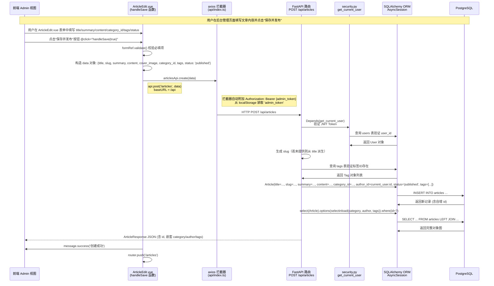

# Blog System 架构分析报告

## 一、评论功能调用链路分析

### 重要说明

> **当前代码库中不存在评论（Comment）功能。** 经过对所有前端组件、后端路由、数据库模型的全面搜索，未发现任何与 `comment` 或 `评论` 相关的实现——没有评论数据库表、没有评论 API 路由、没有前端评论组件。
>
> 以下以后台管理系统中已实现的**"发表文章"**（创建文章）功能作为调用链路分析对象，这是系统中实际存在的、最接近"发表/提交内容"语义的完整端到端流程。同时给出评论功能若要实现时的预期链路设计。

### 1.1 已实现：后台"发表文章"完整调用链路

#### 涉及的数据库表和字段

系统实际涉及以下表和字段：

**`users` 表**（作者信息）

| 字段 | 类型 | 说明 |
|---|---|---|
| `id` | Integer, PK | 用户ID |
| `username` | String(50) | 用户名 |
| `hashed_password` | String(255) | 哈希密码 |
| `role` | String(20) | 角色（admin/user） |

**`articles` 表**（文章主表）

| 字段 | 类型 | 说明 |
|---|---|---|
| `id` | Integer, PK | 文章ID |
| `title` | String(200) | 标题 |
| `slug` | String(200), Unique | URL别名 |
| `summary` | Text | 摘要 |
| `content` | Text | Markdown 正文 |
| `cover_image` | String(500), Nullable | 封面图URL |
| `category_id` | Integer, FK → categories.id | 分类ID |
| `author_id` | Integer, FK → users.id | 作者ID |
| `status` | String(20) | 状态（draft/published） |
| `views` | Integer, default=0 | 阅读数 |
| `created_at` | DateTime | 创建时间 |
| `updated_at` | DateTime | 更新时间 |

**`categories` 表**

| 字段 | 类型 | 说明 |
|---|---|---|
| `id` | Integer, PK | 分类ID |
| `name` | String(50), Unique | 分类名称 |
| `slug` | String(50), Unique | URL别名 |
| `description` | Text, Nullable | 描述 |

**`tags` 表 + `article_tags` 关联表**

| 字段 | 类型 | 说明 |
|---|---|---|
| `tags.id` | Integer, PK | 标签ID |
| `tags.name` | String(50), Unique | 标签名 |
| `article_tags.article_id` | Integer, FK | 文章ID（联合主键） |
| `article_tags.tag_id` | Integer, FK | 标签ID（联合主键） |

#### 调用链路时序图



#### 关键节点说明

| 层级 | 文件 | 关键代码 |
|---|---|---|
| 前端视图 | `frontend-admin/src/views/ArticleEdit.vue` | `handleSave(publish)` 函数 (line 97-132)，构造 data 对象调用 `articlesApi.create()` |
| 前端API层 | `frontend-admin/src/api/index.ts` | `articlesApi.create(data)` (line 245) → `api.post('/articles', data)`；axios 拦截器自动从 `localStorage['admin_token']` 读取 Token |
| 前端状态 | `frontend-admin/src/stores/user.ts` | 登录时 `localStorage.setItem('admin_token', res.access_token)` (line 18) |
| 后端路由 | `backend/app/api/articles.py` | `@router.post("")` → `create_article()` (line 128-170)，权限依赖 `get_current_user` |
| 后端安全 | `backend/app/core/security.py` | `get_current_user()` (line 38-62) 验证 Token 并查询用户 |
| 后端ORM | `backend/app/models/article.py` | Article 模型定义 (line 23-42)，多对多关联表 `article_tags` (line 10-15) |
| 数据库 | PostgreSQL | INSERT articles → INSERT article_tags 关联记录 → SELECT 回读完整对象图 |

#### 前端API封装与后端路由映射

| 前端 API 函数 | HTTP 方法 | 后端 URL 路径 | 对应后端路由函数 |
|---|---|---|---|
| `authApi.login()` | POST | `/api/auth/login` | `auth.py:login()` (line 43) |
| `authApi.getCurrentUser()` | GET | `/api/auth/me` | `auth.py:get_me()` (line 64) |
| `articlesApi.create()` | POST | `/api/articles` | `articles.py:create_article()` (line 128) |
| `articlesApi.update()` | PUT | `/api/articles/{id}` | `articles.py:update_article()` (line 173) |
| `articlesApi.delete()` | DELETE | `/api/articles/{id}` | `articles.py:delete_article()` (line 215) |
| `categoriesApi.create()` | POST | `/api/categories` | `categories.py:create_category()` (line 48) |
| `tagsApi.create()` | POST | `/api/tags` | `tags.py:create_tag()` (line 48) |

---

## 二、JWT 认证安全分析

### 2.1 当前实现概览

`backend/app/core/security.py` 中的认证实现：

**Token 生成（`create_access_token`，line 27-35）**：

```python
def create_access_token(data: dict, expires_delta: Optional[timedelta] = None) -> str:
    to_encode = data.copy()
    if expires_delta:
        expire = datetime.utcnow() + expires_delta
    else:
        expire = datetime.utcnow() + timedelta(minutes=settings.ACCESS_TOKEN_EXPIRE_MINUTES)
    to_encode.update({"exp": expire})
    encoded_jwt = jwt.encode(to_encode, settings.SECRET_KEY, algorithm=settings.ALGORITHM)
    return encoded_jwt
```

**Token 验证（`get_current_user`，line 38-62）**：

```python
async def get_current_user(credentials: HTTPAuthorizationCredentials = Depends(security), db: AsyncSession = Depends(get_db)) -> User:
    token = credentials.credentials
    payload = jwt.decode(token, settings.SECRET_KEY, algorithms=[settings.ALGORITHM])
    user_id_str = payload.get("sub")
    if user_id_str is None:
        raise credentials_exception
    user_id = int(user_id_str)
    result = await db.execute(select(User).where(User.id == user_id))
    user = result.scalar_one_or_none()
    if user is None:
        raise credentials_exception
    return user
```

**配置参数（`backend/app/core/config.py`，line 12-14）**：

```python
SECRET_KEY: str = "your-super-secret-key-change-in-production"
ALGORITHM: str = "HS256"
ACCESS_TOKEN_EXPIRE_MINUTES: int = 60 * 24 * 7  # 7 days
```

### 2.2 安全隐患分析

#### 隐患一：Token 刷新机制缺失与过期策略不合理

**问题描述**：

系统**没有实现 Token 刷新（Refresh Token）机制**。登录时仅生成一个 `access_token`，有效期长达 **7 天**，且一旦过期，用户必须重新输入账号密码登录。这带来以下问题：

1. **长有效期 = 高风险窗口**：7天内 Token 若被窃取，攻击者可任意访问用户账户。
2. **用户体验差**：7天后用户被动掉线，必须重新登录，体验不友好。
3. **无法主动失效**：没有服务端的 Token 黑名单机制，被盗 Token 在过期前始终有效。

**修复方案**：

1. 引入 **Refresh Token** 机制：Access Token 短有效期（如 15 分钟），Refresh Token 长有效期（如 7 天），客户端通过 Refresh Token 静默刷新。
2. 在 `users` 表中新增 `refresh_token_hash` 和 `refresh_token_expires_at` 字段。
3. 新增 `/api/auth/refresh` 端点接受 Refresh Token，验证后签发新的 Access Token。

```python
# 新增 Token 类型
class TokenResponse(BaseModel):
    access_token: str
    refresh_token: str
    token_type: str = "bearer"

# 修改 login 端点返回双 Token
@router.post("/login", response_model=TokenResponse)
async def login(login_data: UserLogin, db: AsyncSession = Depends(get_db)):
    # ... 现有验证逻辑 ...
    access_token = create_access_token(data={"sub": str(user.id)}, expires_delta=timedelta(minutes=15))
    refresh_token = create_access_token(data={"sub": str(user.id), "type": "refresh"}, expires_delta=timedelta(days=7))
    # 将 refresh_token 哈希后存入数据库
    user.refresh_token_hash = get_password_hash(refresh_token)
    user.refresh_token_expires_at = datetime.utcnow() + timedelta(days=7)
    await db.flush()
    return TokenResponse(access_token=access_token, refresh_token=refresh_token)

# 新增 refresh 端点
@router.post("/refresh", response_model=TokenResponse)
async def refresh_token(refresh_data: RefreshRequest, db: AsyncSession = Depends(get_db)):
    try:
        payload = jwt.decode(refresh_data.refresh_token, settings.SECRET_KEY, algorithms=[settings.ALGORITHM])
        if payload.get("type") != "refresh":
            raise HTTPException(status_code=401, detail="无效的刷新令牌")
        user_id = int(payload.get("sub"))
    except JWTError:
        raise HTTPException(status_code=401, detail="刷新令牌已过期")

    user = await db.get(User, user_id)
    if not user or not user.refresh_token_hash or not verify_password(refresh_data.refresh_token, user.refresh_token_hash):
        raise HTTPException(status_code=401, detail="刷新令牌无效")
    if user.refresh_token_expires_at < datetime.utcnow():
        raise HTTPException(status_code=401, detail="刷新令牌已过期")

    new_access_token = create_access_token(data={"sub": str(user.id)}, expires_delta=timedelta(minutes=15))
    new_refresh_token = create_access_token(data={"sub": str(user.id), "type": "refresh"}, expires_delta=timedelta(days=7))
    user.refresh_token_hash = get_password_hash(new_refresh_token)
    user.refresh_token_expires_at = datetime.utcnow() + timedelta(days=7)
    await db.flush()
    return TokenResponse(access_token=new_access_token, refresh_token=new_refresh_token)
```

#### 隐患二：密钥管理薄弱与硬编码风险

**问题描述**：

1. **`SECRET_KEY` 使用默认值**：`settings.SECRET_KEY = "your-super-secret-key-change-in-production"`（config.py line 12）。如果生产环境忘记配置 `SECRET_KEY` 环境变量，所有 Token 将使用此公开的硬编码密钥签名，任何人都可以伪造用户 Token。
2. **密钥无轮换机制**：密钥一旦设置永远不变，无法进行密钥轮换。若密钥泄露，已签发的所有 Token 全部失效。
3. **缺乏密钥长度校验**：未验证密钥长度，弱密钥可被暴力破解。

**修复方案**：

1. 在 `Settings` 初始化时校验 `SECRET_KEY` 非默认值，生产环境强制抛出错误。
2. 增加密钥长度校验（建议至少 32 字节 = 256 位）。
3. 支持通过环境变量传入密钥，Dockerfile 中禁止设置默认值。

```python
class Settings(BaseSettings):
    SECRET_KEY: str = ""  # 不设默认值，必须从环境变量读取
    # ...
    def __init__(self, **data):
        super().__init__(**data)
        if not self.SECRET_KEY or self.SECRET_KEY == "your-super-secret-key-change-in-production":
            import warnings
            warnings.warn(
                "\n" + "="*60 + "\n"
                "WARNING: SECRET_KEY is not set or uses the default value!\n"
                "Please set SECRET_KEY environment variable to a random string.\n"
                "="*60,
                RuntimeWarning
            )
        if len(self.SECRET_KEY) < 32:
            raise ValueError(
                "SECRET_KEY must be at least 32 characters long for HS256.\n"
                "Generate one with: python -c \"import secrets; print(secrets.token_urlsafe(64))\""
            )
```

#### 隐患三：无并发登录控制（额外发现）

**问题描述**：

当前实现对同一用户的多次登录**不做任何限制**——每次登录都生成新的 Token，但旧 Token 仍然有效直到过期。这导致：

1. 同一账号可在无限多个设备上同时登录。
2. "登出"仅清除前端 `localStorage` 中的 Token，**服务端无法使旧 Token 失效**。
3. 攻击者若窃取了某设备的 Token，即使用户修改密码，该 Token 在过期前仍可正常登录。

**修复方案**：

1. 在 `users` 表中新增 `current_token_jti` 字段（存储当前生效 Token 的唯一标识）。
2. 签发 Token 时将 `jti`（JWT ID）声明写入 payload，同时更新数据库。
3. 验证 Token 时比对 `jti` 与数据库中存储的值，不匹配则拒绝。
4. 修改密码、主动登出时清空数据库中的 `current_token_jti`。

```python
# create_access_token 时添加 jti
import secrets
def create_access_token(data: dict, expires_delta=None):
    to_encode = data.copy()
    to_encode["jti"] = secrets.token_hex(16)  # 唯一标识
    # ... 过期逻辑 ...
    return jwt.encode(to_encode, settings.SECRET_KEY, algorithm=settings.ALGORITHM)

# 验证时检查 jti 是否匹配当前用户
async def get_current_user(credentials, db):
    token = credentials.credentials
    payload = jwt.decode(token, settings.SECRET_KEY, algorithms=[settings.ALGORITHM])
    user_id = int(payload.get("sub"))
    jti = payload.get("jti")
    user = await db.get(User, user_id)
    if user is None:
        raise credentials_exception
    # 关键：检查 jti 是否为用户当前活跃的 Token
    if user.current_token_jti and user.current_token_jti != jti:
        raise HTTPException(status_code=401, detail="Token 已失效，请重新登录")
    return user

# 修改密码/登出时清空 current_token_jti
@router.post("/logout")
async def logout(current_user=Depends(get_current_user), db=Depends(get_db)):
    current_user.current_token_jti = None
    await db.flush()
    return {"message": "已登出"}
```

---

## 三、前端代码复用与 Monorepo 改造方案

### 3.1 重复实现模块分析

两个前端项目代码结构高度相似，存在大量重复：

| 重复模块 | 重复程度 | `frontend-web` 路径 | `frontend-admin` 路径 | 具体差异 |
|---|---|---|---|---|
| **API 封装层** | 几乎完全相同 | `src/api/index.ts` | `src/api/index.ts` | admin 多了 `isNetworkError`、`isAuthError`、`usersApi`、`statsApi`、`uploadApi`；web 只有只读 API |
| **Axios 实例配置** | 完全相同 | `src/api/index.ts:79-119` | `src/api/index.ts:124-167` | 拦截器逻辑一致，仅 Token 存储 key 不同（web→`token`，admin→`admin_token`） |
| **TypeScript 类型定义** | 80% 相同 | `src/api/index.ts:122-213` | `src/api/index.ts:169-229` | `User`/`Article`/`Category`/`Tag` 类型几乎一致；`PaginatedResponse` 相同 |
| **用户 Store** | 90% 相同 | `src/stores/user.ts` | `src/stores/user.ts` | admin 多了 `loading`/`initialized`/`initPromise`/`isAdmin`；Token key 不同 |
| **样式文件** | 80% 相同 | `src/styles/main.css` | `src/styles/main.css` | 主题变量一致；web 多了 `.blog-content` 类；scrollbar 样式略有差异 |
| **路由结构** | 类似模式 | `src/router/index.ts` | `src/router/index.ts` | 守卫逻辑不同（web 无鉴权守卫，admin 有）；路由表不同 |
| **构建配置** | 几乎完全相同 | `vite.config.ts` | `vite.config.ts` | port 不同（web: 5173, admin: 5174）；alias 相同 |
| **依赖版本** | 完全一致 | `package.json` | `package.json` | vue/router/pinia/naive-ui/axios/date-fns 版本完全相同 |

### 3.2 Monorepo 改造方案

#### 目录结构

```
blog-system/                    ← monorepo 根目录
├── package.json                ← workspace 根 package.json
├── tsconfig.base.json          ← 共享 TypeScript 配置
├── eslint.config.js            ← 共享 ESLint 配置
├── .gitignore
│
├── packages/
│   ├── shared-types/           ← 共享 TypeScript 类型定义
│   │   ├── package.json
│   │   ├── tsconfig.json
│   │   ├── src/
│   │   │   ├── index.ts
│   │   │   ├── user.ts         ← User, UserResponse
│   │   │   ├── article.ts      ← Article, ArticleCreate, ArticleUpdate
│   │   │   ├── category.ts     ← Category, CategoryCreate
│   │   │   ├── tag.ts          ← Tag, TagCreate
│   │   │   └── common.ts       ← PaginatedResponse, PaginationParams
│   │   └── dist/               ← 构建产物
│   │
│   ├── shared-api/             ← 共享 API 层（axios + 通用拦截器）
│   │   ├── package.json
│   │   ├── tsconfig.json
│   │   ├── src/
│   │   │   ├── index.ts       ← 导出 createApi, getErrorMessage, ERROR_MESSAGES
│   │   │   ├── client.ts       ← createAxiosClient(baseURL, tokenKey)
│   │   │   └── errors.ts       ← 错误消息映射
│   │   └── dist/
│   │
│   ├── shared-store/           ← 共享 Pinia Store
│   │   ├── package.json
│   │   ├── tsconfig.json
│   │   ├── src/
│   │   │   ├── index.ts
│   │   │   └── userStore.ts   ← createUserStore(tokenKey: string, isAdmin: boolean)
│   │   └── dist/
│   │
│   └── shared-styles/          ← 共享样式
│       ├── package.json
│       ├── src/
│       │   ├── variables.css   ← CSS 变量（主题色、背景色等）
│       │   ├── tailwind.config.js
│       │   └── index.css      ← 基础重置 + 共享工具类
│       └── dist/
│
├── apps/
│   ├── web/                    ← 原 frontend-web
│   │   ├── package.json        ← 依赖 shared-* 包
│   │   ├── vite.config.ts
│   │   ├── tsconfig.json
│   │   └── src/
│   │       ├── main.ts
│   │       ├── App.vue
│   │       ├── router/
│   │       │   └── index.ts    ← 仅保留 web 专属路由
│   │       ├── views/
│   │       │   ├── Home.vue
│   │       │   ├── Articles.vue
│   │       │   ├── ArticleDetail.vue
│   │       │   ├── Tags.vue
│   │       │   ├── About.vue
│   │       │   ├── Login.vue
│   │       │   ├── Register.vue
│   │       │   └── NotFound.vue
│   │       ├── layouts/
│   │       │   └── BlogLayout.vue
│   │       ├── api/
│   │       │   └── index.ts    ← 从 shared-api 引入 createApi，传入 web 特有参数
│   │       ├── stores/
│   │       │   └── user.ts     ← 从 shared-store 引入，传入 tokenKey='token'
│   │       └── styles/
│   │           └── main.css    ← import shared-styles，加 web 专属样式
│   │
│   └── admin/                  ← 原 frontend-admin
│       ├── package.json        ← 依赖 shared-* 包
│       ├── vite.config.ts
│       ├── tsconfig.json
│       └── src/
│           ├── main.ts
│           ├── App.vue
│           ├── router/
│           │   └── index.ts    ← 仅保留 admin 专属路由和守卫
│           ├── views/
│           │   ├── Dashboard.vue
│           │   ├── ArticleList.vue
│           │   ├── ArticleEdit.vue
│           │   ├── Categories.vue
│           │   ├── Tags.vue
│           │   ├── Users.vue
│           │   ├── Settings.vue
│           │   ├── Login.vue
│           │   └── Register.vue
│           ├── layouts/
│           │   └── AdminLayout.vue
│           ├── api/
│           │   └── index.ts    ← 从 shared-api 引入 createApi，传入 admin 特有参数
│           ├── stores/
│           │   └── user.ts     ← 从 shared-store 引入，传入 tokenKey='admin_token'
│           └── styles/
│               └── main.css    ← import shared-styles，加 admin 专属样式
```

#### 根 `package.json` 配置

```json
{
  "name": "blog-system",
  "private": true,
  "version": "1.0.0",
  "workspaces": [
    "packages/*",
    "apps/*"
  ],
  "scripts": {
    "dev:web": "npm run dev -w @blog/web",
    "dev:admin": "npm run dev -w @blog/admin",
    "dev": "npm run dev:web & npm run dev:admin",
    "build:shared": "npm run build -w @blog/shared-types && npm run build -w @blog/shared-api && npm run build -w @blog/shared-store && npm run build -w @blog/shared-styles",
    "build:web": "npm run build -w @blog/web",
    "build:admin": "npm run build -w @blog/admin",
    "build": "npm run build:shared && npm run build:web && npm run build:admin",
    "typecheck": "npm run typecheck -w @blog/web && npm run typecheck -w @blog/admin"
  },
  "engines": {
    "node": ">=18.0.0"
  }
}
```

#### 共享包 `package.json` 配置示例

**`packages/shared-types/package.json`**：

```json
{
  "name": "@blog/shared-types",
  "version": "1.0.0",
  "type": "module",
  "main": "dist/index.js",
  "types": "dist/index.d.ts",
  "exports": {
    ".": {
      "types": "./dist/index.d.ts",
      "import": "./dist/index.js"
    }
  },
  "scripts": {
    "build": "tsc",
    "typecheck": "tsc --noEmit"
  },
  "devDependencies": {
    "typescript": "^5.4.3"
  }
}
```

**`packages/shared-api/package.json`**：

```json
{
  "name": "@blog/shared-api",
  "version": "1.0.0",
  "type": "module",
  "main": "dist/index.js",
  "types": "dist/index.d.ts",
  "exports": {
    ".": {
      "types": "./dist/index.d.ts",
      "import": "./dist/index.js"
    }
  },
  "scripts": {
    "build": "tsc",
    "typecheck": "tsc --noEmit"
  },
  "dependencies": {
    "@blog/shared-types": "1.0.0",
    "axios": "^1.6.8"
  },
  "devDependencies": {
    "typescript": "^5.4.3"
  }
}
```

**`packages/shared-store/package.json`**：

```json
{
  "name": "@blog/shared-store",
  "version": "1.0.0",
  "type": "module",
  "main": "dist/index.js",
  "types": "dist/index.d.ts",
  "exports": {
    ".": {
      "types": "./dist/index.d.ts",
      "import": "./dist/index.js"
    }
  },
  "scripts": {
    "build": "tsc",
    "typecheck": "tsc --noEmit"
  },
  "dependencies": {
    "@blog/shared-api": "1.0.0",
    "@blog/shared-types": "1.0.0",
    "pinia": "^2.1.7",
    "vue": "^3.4.21"
  },
  "devDependencies": {
    "typescript": "^5.4.3"
  }
}
```

**`packages/shared-styles/package.json`**：

```json
{
  "name": "@blog/shared-styles",
  "version": "1.0.0",
  "main": "src/index.css",
  "files": ["src"],
  "scripts": {
    "build": "echo 'No build step needed for styles'",
    "typecheck": "echo 'No typecheck needed for styles'"
  },
  "dependencies": {
    "tailwindcss": "^3.4.3"
  }
}
```

#### 应用包 `package.json` 配置示例

**`apps/web/package.json`**：

```json
{
  "name": "@blog/web",
  "version": "1.0.0",
  "type": "module",
  "scripts": {
    "dev": "vite",
    "build": "vue-tsc && vite build",
    "preview": "vite preview",
    "typecheck": "vue-tsc --noEmit"
  },
  "dependencies": {
    "@blog/shared-api": "1.0.0",
    "@blog/shared-types": "1.0.0",
    "@blog/shared-store": "1.0.0",
    "@blog/shared-styles": "1.0.0",
    "naive-ui": "^2.38.1",
    "@vicons/ionicons5": "^0.12.0",
    "marked": "^12.0.1",
    "vue": "^3.4.21",
    "vue-router": "^4.3.0",
    "pinia": "^2.1.7",
    "date-fns": "^3.6.0"
  },
  "devDependencies": {
    "@vitejs/plugin-vue": "^5.0.4",
    "@types/node": "^20.12.5",
    "autoprefixer": "^10.4.19",
    "postcss": "^8.4.38",
    "tailwindcss": "^3.4.3",
    "typescript": "^5.4.3",
    "vite": "^5.2.8",
    "vue-tsc": "^2.0.7"
  }
}
```

**`apps/admin/package.json`**：

```json
{
  "name": "@blog/admin",
  "version": "1.0.0",
  "type": "module",
  "scripts": {
    "dev": "vite",
    "build": "vue-tsc && vite build",
    "preview": "vite preview",
    "typecheck": "vue-tsc --noEmit"
  },
  "dependencies": {
    "@blog/shared-api": "1.0.0",
    "@blog/shared-types": "1.0.0",
    "@blog/shared-store": "1.0.0",
    "@blog/shared-styles": "1.0.0",
    "md-editor-v3": "^6.3.1",
    "naive-ui": "^2.38.1",
    "@vicons/ionicons5": "^0.12.0",
    "vue": "^3.4.21",
    "vue-router": "^4.3.0",
    "pinia": "^2.1.7",
    "date-fns": "^3.6.0"
  },
  "devDependencies": {
    "@vitejs/plugin-vue": "^5.0.4",
    "@types/node": "^20.12.5",
    "autoprefixer": "^10.4.19",
    "postcss": "^8.4.38",
    "tailwindcss": "^3.4.3",
    "typescript": "^5.4.3",
    "vite": "^5.2.8",
    "vue-tsc": "^2.0.7"
  }
}
```

#### 共享类型定义（`packages/shared-types/src/index.ts`）

```typescript
export interface User {
  id: number
  username: string
  email: string
  role: 'admin' | 'user'
  avatar?: string
  created_at: string
}

export interface Category {
  id: number
  name: string
  slug: string
  description?: string
  article_count?: number
}

export interface Tag {
  id: number
  name: string
  slug: string
  color?: string
  article_count?: number
}

export interface Article {
  id: number
  title: string
  slug: string
  summary: string
  content: string
  cover_image?: string
  category_id: number
  category?: Category
  tags: Tag[]
  author: User
  views: number
  status: 'draft' | 'published'
  created_at: string
  updated_at: string
}

export interface PaginatedResponse<T> {
  items: T[]
  total: number
  page: number
  page_size: number
  pages: number
}

export type PaginationParams = {
  page?: number
  page_size?: number
}
```

#### 共享 API 层（`packages/shared-api/src/client.ts`）

```typescript
import axios, { type AxiosError } from 'axios'
import type { ApiError } from './errors'

export function createApi(baseURL: string, tokenKey: string) {
  const api = axios.create({
    baseURL: import.meta.env.VITE_API_BASE_URL || baseURL,
    timeout: 10000,
    headers: { 'Content-Type': 'application/json' }
  })

  api.interceptors.request.use((config) => {
    const token = localStorage.getItem(tokenKey)
    if (token) config.headers.Authorization = `Bearer ${token}`
    return config
  })

  api.interceptors.response.use(
    (response) => response.data,
    (error: AxiosError<ApiError>) => {
      if (error.response?.status === 401) {
        localStorage.removeItem(tokenKey)
      }
      if (import.meta.env.DEV) {
        console.error('[API Error]', {
          url: error.config?.url,
          method: error.config?.method,
          status: error.response?.status,
          data: error.response?.data
        })
      }
      return Promise.reject(error)
    }
  )

  return api
}
```

#### 应用内 API 封装示例（`apps/web/src/api/index.ts`）

```typescript
import { createApi, getErrorMessage } from '@blog/shared-api'
import type { User, Article, Category, Tag, PaginatedResponse } from '@blog/shared-types'

const api = createApi('/api', 'token')

export const authApi = {
  login: (data: { username: string; password: string }) =>
    api.post('/auth/login', data),
  register: (data: { username: string; email: string; password: string }) =>
    api.post('/auth/register', data),
  getCurrentUser: () => api.get('/auth/me')
}

export const articlesApi = {
  getList: (params?: { page?: number; page_size?: number; category_id?: number; tag_id?: number; status?: string }) =>
    api.get('/articles', { params }),
  getById: (id: number) => api.get(`/articles/${id}`),
  getRecent: (limit?: number) => api.get('/articles/recent', { params: { limit } })
}

export const categoriesApi = { getList: () => api.get('/categories') }
export const tagsApi = { getList: () => api.get('/tags') }
export const settingsApi = { get: () => api.get('/settings') }

export { getErrorMessage }
export type { User, Article, Category, Tag, PaginatedResponse }
export default api
```

---

## 总结

| 分析项 | 核心发现 |
|---|---|
| **评论功能** | 当前代码库**不存在**评论功能。本文以"后台发表文章"流程作为替代，给出了完整的前端→API→路由→ORM→数据库调用链路时序图。 |
| **JWT 安全隐患** | ① 无 Refresh Token 机制，7天有效期内无法主动失效；② SECRET_KEY 使用硬编码默认值，存在密钥泄露风险；③ 无并发登录控制，登出/改密后旧 Token 仍有效。已分别给出修复方案和示例代码。 |
| **前端代码复用** | 两个项目在 API 封装、类型定义、用户 Store、样式、构建配置上存在 **60-90% 的重复**。建议通过 npm workspace 的 monorepo 方案提取 `shared-types`、`shared-api`、`shared-store`、`shared-styles` 四个共享包。 |
