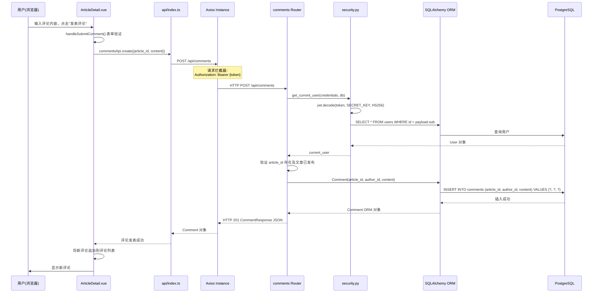

# Blog System 架构分析报告

---

## 一、评论发表调用链路分析

### 关键发现：当前系统未实现评论功能

经过对项目全部源码的仔细审查，**该 Blog System 当前不存在评论（Comment）功能的实现**。具体依据如下：

1. **后端层面**：
   - `backend/app/models/` 下仅有 `user.py`、`article.py`、`category.py`、`tag.py`、`settings.py` 五个模型文件，**不存在 Comment 模型**。
   - `backend/app/api/` 下仅有 `auth.py`、`articles.py`、`categories.py`、`tags.py`、`users.py`、`settings.py`、`stats.py`、`upload.py` 八个路由文件，**不存在 comments 路由**。
   - `backend/app/models/__init__.py` 仅导出 `User`、`Category`、`Tag`、`Article`、`article_tags`、`SiteSettings`，无 Comment 相关内容。
   - 全局搜索 `comment` 关键字，返回结果为零匹配。

2. **前端层面**：
   - `frontend-web/src/views/ArticleDetail.vue` 是文章详情页，页面仅展示文章标题、摘要、正文（Markdown 渲染）、作者信息、标签列表，**无任何评论输入框或评论列表组件**。
   - `frontend-web/src/api/index.ts` 中的 `articlesApi` 仅暴露 `getList`、`getById`、`getRecent` 三个只读方法，**无评论相关 API 调用**。
   - `frontend-admin/src/api/index.ts` 中的 `articlesApi` 暴露 `getList`、`getById`、`create`、`update`、`delete`，同样**无评论管理 API**。

3. **数据库层面**：
   - ORM 模型定义的数据库表为 `users`、`articles`、`categories`、`tags`、`article_tags`（多对多关联表）、`site_settings`，**无 comments 表**。

### 基于现有代码的最接近链路：文章详情页浏览

由于评论功能不存在，以下梳理用户在前台博客页面**浏览文章详情**的完整调用链路（这是 ArticleDetail 页面实际执行的交互路径）：

```mermaid
sequenceDiagram
    participant User as 用户(浏览器)
    participant Vue as ArticleDetail.vue
    article API as frontend-web/src/api/index.ts
    participant Axios as Axios Instance
    participant FastAPI as FastAPI Router
    participant Security as security.py
    participant ORM as SQLAlchemy ORM
    participant DB as PostgreSQL

    User->>Vue: 点击文章链接 /article/:id
    Vue->>Vue: onMounted() 获取 route.params.id
    Vue->>article API: articlesApi.getById(id)
    article API->>Axios: GET /api/articles/{id}
    Note over Axios: 请求拦截器:<br/>从 localStorage 读取 token<br/>设置 Authorization: Bearer {token}
    Axios->>FastAPI: HTTP GET /api/articles/{id}

    FastAPI->>Security: get_optional_user(credentials, db)
    alt 携带有效 Token
        Security->>Security: jwt.decode(token, SECRET_KEY, HS256)
        Security->>ORM: SELECT * FROM users WHERE id = payload.sub
        ORM->>DB: 执行 SQL 查询
        DB-->>ORM: 返回 User 行
        ORM-->>Security: User 对象
        Security-->>FastAPI: current_user = User
    else 无 Token 或 Token 无效
        Security-->>FastAPI: current_user = None
    end

    FastAPI->>ORM: SELECT articles WHERE id = article_id<br/>JOIN categories, users, tags
    ORM->>DB: 执行 SQL 查询（含 selectinload 预加载关联）
    DB-->>ORM: 返回 Article 行及关联数据
    ORM-->>FastAPI: Article ORM 对象

    alt article.status != "published" 且用户非管理员
        FastAPI-->>Axios: HTTP 404 "文章不存在"
        Axios-->>Vue: 抛出错误
        Vue->>Vue: 显示 NEmpty "文章不存在"
    else article 可见
        FastAPI->>ORM: article.views += 1, db.flush()
        ORM->>DB: UPDATE articles SET views = views + 1 WHERE id = ?
        DB-->>ORM: 更新成功
        FastAPI-->>Axios: HTTP 200 ArticleResponse JSON
    end

    Note over Axios: 响应拦截器:<br/>response.data 直接返回
    Axios-->>article API: Article 对象
    article API-->>Vue: article.value = Article
    Vue->>Vue: marked(article.content) 渲染 Markdown
    Vue->>User: 显示文章标题、内容、作者、标签、阅读量
```

### 涉及的数据库表和字段

| 表名 | 关键字段 | 说明 |
|------|----------|------|
| `articles` | `id`, `title`, `slug`, `summary`, `content`, `cover_image`, `category_id`, `author_id`, `status`, `views`, `created_at`, `updated_at` | 文章主表 |
| `users` | `id`, `username`, `email`, `hashed_password`, `role`, `avatar`, `created_at`, `updated_at` | 用户表，通过 `author_id` 关联 |
| `categories` | `id`, `name`, `slug`, `description`, `created_at`, `updated_at` | 分类表，通过 `category_id` 关联 |
| `tags` | `id`, `name`, `slug`, `color`, `created_at`, `updated_at` | 标签表 |
| `article_tags` | `article_id`, `tag_id` | 文章-标签多对多关联表 |

### 若要实现评论功能，建议的完整调用链路设计



---

## 二、JWT 认证安全隐患分析

### 当前实现概览

基于 `backend/app/core/security.py` 和 `backend/app/core/config.py` 的实际代码：

- **密钥**：`SECRET_KEY = "your-super-secret-key-change-in-production"`（硬编码默认值）
- **算法**：HS256（对称加密）
- **Token 有效期**：`ACCESS_TOKEN_EXPIRE_MINUTES = 60 * 24 * 7`（7天）
- **Token 载荷**：仅包含 `sub`（用户ID字符串）和 `exp`（过期时间）
- **无 Refresh Token 机制**：仅签发单一 access_token
- **无 Token 黑名单/撤销机制**
- **无并发登录控制**

### 隐患一：密钥管理缺陷

**问题描述**：

`config.py:12` 中 `SECRET_KEY` 的默认值为硬编码字符串 `"your-super-secret-key-change-in-production"`。虽然 Pydantic Settings 支持通过 `.env` 文件覆盖，但存在以下风险：

1. 若部署时未配置 `.env` 或忘记修改 `SECRET_KEY`，将使用此公开的默认密钥，攻击者可直接伪造任意用户的 JWT Token。
2. 代码仓库中 `.env.example` 可能被误填入真实密钥后提交，造成密钥泄露。
3. 密钥无轮换机制，一旦泄露无法在不使所有用户掉线的情况下更换。
4. `ALGORITHM` 也硬编码为 `HS256`，无法灵活切换。

**修复方案**：

```python
# config.py - 修复后
from pydantic_settings import BaseSettings
from typing import Optional, List
import secrets

class Settings(BaseSettings):
    PROJECT_NAME: str = "Blog API"
    DATABASE_URL: str = "postgresql+asyncpg://postgres:postgres@db:5432/blog"

    SECRET_KEY: str = ""  # 必须通过环境变量提供，不设默认值
    ALGORITHM: str = "HS256"
    ACCESS_TOKEN_EXPIRE_MINUTES: int = 60 * 24 * 7
    REFRESH_TOKEN_EXPIRE_DAYS: int = 30

    ADMIN_USERNAME: str = "admin"
    ADMIN_EMAIL: str = "admin@example.com"
    ADMIN_PASSWORD: str = "admin123"

    CORS_ORIGINS: str = "*"

    @model_validator(mode='after')
    def validate_secret_key(self):
        if not self.SECRET_KEY:
            raise ValueError(
                "SECRET_KEY 必须通过环境变量 SECRET_KEY 设置，"
                "可使用: python -c \"import secrets; print(secrets.token_urlsafe(32))\" 生成"
            )
        if len(self.SECRET_KEY) < 32:
            raise ValueError("SECRET_KEY 长度不能少于 32 个字符")
        return self

    @property
    def cors_origins_list(self) -> List[str]:
        if self.CORS_ORIGINS == "*":
            return ["*"]
        return [origin.strip() for origin in self.CORS_ORIGINS.split(",")]

    class Config:
        env_file = ".env"
        case_sensitive = True

settings = Settings()
```

同时应在 `.env.example` 中添加提示：
```
# 必填！使用 python -c "import secrets; print(secrets.token_urlsafe(32))" 生成
SECRET_KEY=
```

### 隐患二：无 Token 刷新机制（Refresh Token）

**问题描述**：

当前系统仅签发单一 `access_token`，有效期长达 7 天（`config.py:13`）。这带来两个矛盾：

1. **若缩短有效期**（如 15 分钟），用户需要频繁重新登录，体验差。
2. **若保持长有效期**（当前 7 天），Token 一旦被盗用，攻击者可在 7 天内自由使用，且无任何撤销手段。

没有 Refresh Token 机制意味着：
- Token 过期后必须重新输入用户名密码登录
- 无法实现"长期登录"与"短期安全"的平衡
- 无法在 Token 泄露时仅撤销特定 Token

**修复方案**：

```python
# security.py - 增加双 Token 机制
from datetime import datetime, timedelta
from typing import Optional, Tuple
from jose import JWTError, jwt
from passlib.context import CryptContext
from fastapi import Depends, HTTPException, status
from fastapi.security import HTTPBearer, HTTPAuthorizationCredentials
from sqlalchemy.ext.asyncio import AsyncSession
from sqlalchemy import select

from app.core.config import settings
from app.core.database import get_db
from app.models.user import User

pwd_context = CryptContext(schemes=["bcrypt"], deprecated="auto")
security = HTTPBearer()

def verify_password(plain_password: str, hashed_password: str) -> bool:
    return pwd_context.verify(plain_password, hashed_password)

def get_password_hash(password: str) -> str:
    return pwd_context.hash(password)

def create_access_token(data: dict, expires_delta: Optional[timedelta] = None) -> str:
    to_encode = data.copy()
    to_encode.update({"type": "access"})
    if expires_delta:
        expire = datetime.utcnow() + expires_delta
    else:
        expire = datetime.utcnow() + timedelta(minutes=settings.ACCESS_TOKEN_EXPIRE_MINUTES)
    to_encode.update({"exp": expire, "iat": datetime.utcnow()})
    return jwt.encode(to_encode, settings.SECRET_KEY, algorithm=settings.ALGORITHM)

def create_refresh_token(data: dict) -> str:
    to_encode = data.copy()
    to_encode.update({
        "type": "refresh",
        "exp": datetime.utcnow() + timedelta(days=settings.REFRESH_TOKEN_EXPIRE_DAYS),
        "iat": datetime.utcnow()
    })
    return jwt.encode(to_encode, settings.SECRET_KEY, algorithm=settings.ALGORITHM)

def create_token_pair(user_id: int) -> Tuple[str, str]:
    data = {"sub": str(user_id)}
    access_token = create_access_token(data)
    refresh_token = create_refresh_token(data)
    return access_token, refresh_token

async def get_current_user(
    credentials: HTTPAuthorizationCredentials = Depends(security),
    db: AsyncSession = Depends(get_db)
) -> User:
    credentials_exception = HTTPException(
        status_code=status.HTTP_401_UNAUTHORIZED,
        detail="无效的认证凭据",
        headers={"WWW-Authenticate": "Bearer"},
    )
    try:
        token = credentials.credentials
        payload = jwt.decode(token, settings.SECRET_KEY, algorithms=[settings.ALGORITHM])
        if payload.get("type") != "access":
            raise credentials_exception
        user_id_str = payload.get("sub")
        if user_id_str is None:
            raise credentials_exception
        user_id = int(user_id_str)
    except (JWTError, ValueError):
        raise credentials_exception

    result = await db.execute(select(User).where(User.id == user_id))
    user = result.scalar_one_or_none()

    if user is None:
        raise credentials_exception
    return user

async def get_current_admin(current_user: User = Depends(get_current_user)) -> User:
    if current_user.role != "admin":
        raise HTTPException(
            status_code=status.HTTP_403_FORBIDDEN,
            detail="权限不足"
        )
    return current_user

async def get_optional_user(
    credentials: Optional[HTTPAuthorizationCredentials] = Depends(HTTPBearer(auto_error=False)),
    db: AsyncSession = Depends(get_db)
) -> Optional[User]:
    if not credentials:
        return None
    try:
        return await get_current_user(credentials, db)
    except HTTPException:
        return None
```

对应修改 `auth.py` 路由：

```python
# auth.py - 增加 refresh 端点
@router.post("/login", response_model=Token)
async def login(login_data: UserLogin, db: AsyncSession = Depends(get_db)):
    password = login_data.password
    result = await db.execute(select(User).where(User.username == login_data.username))
    user = result.scalar_one_or_none()

    if not user or not verify_password(password, user.hashed_password):
        raise HTTPException(
            status_code=status.HTTP_401_UNAUTHORIZED,
            detail="用户名或密码错误"
        )

    access_token, refresh_token = create_token_pair(user.id)
    return Token(access_token=access_token, refresh_token=refresh_token)

@router.post("/refresh", response_model=Token)
async def refresh_token(
    refresh_data: RefreshTokenRequest,
    db: AsyncSession = Depends(get_db)
):
    try:
        payload = jwt.decode(
            refresh_data.refresh_token,
            settings.SECRET_KEY,
            algorithms=[settings.ALGORITHM]
        )
        if payload.get("type") != "refresh":
            raise HTTPException(status_code=401, detail="无效的刷新令牌")
        user_id = int(payload.get("sub"))
    except (JWTError, ValueError):
        raise HTTPException(status_code=401, detail="刷新令牌已过期或无效")

    result = await db.execute(select(User).where(User.id == user_id))
    user = result.scalar_one_or_none()
    if not user:
        raise HTTPException(status_code=401, detail="用户不存在")

    access_token, new_refresh_token = create_token_pair(user.id)
    return Token(access_token=access_token, refresh_token=new_refresh_token)
```

### 隐患三：无并发登录控制

**问题描述**：

当前 JWT 认证是无状态的——Token 一旦签发，在过期前始终有效，无法被撤销。这导致：

1. **Token 被盗后无法使失效**：攻击者获取 Token 后，即使原用户修改密码，旧 Token 在过期前仍然有效。
2. **同一账号可无限并发登录**：无设备数量限制，无法检测异常登录。
3. **无法实现"踢出其他设备"功能**。
4. **密码修改后旧 Token 不失效**：`security.py` 中的 `get_current_user` 仅解码 Token 并查询用户是否存在，不校验 Token 签发时间是否早于密码修改时间。

**修复方案**：

方案 A：基于数据库的 Token 版本控制（轻量级）

```python
# 在 User 模型中增加 token_version 字段
class User(Base):
    __tablename__ = "users"
    id = Column(Integer, primary_key=True, index=True)
    username = Column(String(50), unique=True, index=True, nullable=False)
    email = Column(String(100), unique=True, index=True, nullable=False)
    hashed_password = Column(String(255), nullable=False)
    role = Column(String(20), default="user", nullable=False)
    avatar = Column(String(500), nullable=True)
    token_version = Column(Integer, default=0, nullable=False)
    created_at = Column(DateTime, default=datetime.utcnow, nullable=False)
    updated_at = Column(DateTime, default=datetime.utcnow, onupdate=datetime.utcnow, nullable=False)
    articles = relationship("Article", back_populates="author")

# 在 Token 载荷中包含 token_version
def create_access_token(data: dict, expires_delta: Optional[timedelta] = None) -> str:
    to_encode = data.copy()
    to_encode.update({"type": "access"})
    if expires_delta:
        expire = datetime.utcnow() + expires_delta
    else:
        expire = datetime.utcnow() + timedelta(minutes=settings.ACCESS_TOKEN_EXPIRE_MINUTES)
    to_encode.update({"exp": expire, "iat": datetime.utcnow()})
    return jwt.encode(to_encode, settings.SECRET_KEY, algorithm=settings.ALGORITHM)

# 在 login 时将 token_version 写入 Token
@router.post("/login", response_model=Token)
async def login(login_data: UserLogin, db: AsyncSession = Depends(get_db)):
    result = await db.execute(select(User).where(User.username == login_data.username))
    user = result.scalar_one_or_none()
    if not user or not verify_password(login_data.password, user.hashed_password):
        raise HTTPException(status_code=401, detail="用户名或密码错误")

    data = {"sub": str(user.id), "tv": user.token_version}
    access_token, refresh_token = create_token_pair(data)
    return Token(access_token=access_token, refresh_token=refresh_token)

# 在 get_current_user 中校验 token_version
async def get_current_user(
    credentials: HTTPAuthorizationCredentials = Depends(security),
    db: AsyncSession = Depends(get_db)
) -> User:
    credentials_exception = HTTPException(
        status_code=status.HTTP_401_UNAUTHORIZED,
        detail="无效的认证凭据",
        headers={"WWW-Authenticate": "Bearer"},
    )
    try:
        token = credentials.credentials
        payload = jwt.decode(token, settings.SECRET_KEY, algorithms=[settings.ALGORITHM])
        if payload.get("type") != "access":
            raise credentials_exception
        user_id_str = payload.get("sub")
        if user_id_str is None:
            raise credentials_exception
        user_id = int(user_id_str)
    except (JWTError, ValueError):
        raise credentials_exception

    result = await db.execute(select(User).where(User.id == user_id))
    user = result.scalar_one_or_none()
    if user is None:
        raise credentials_exception

    # 校验 token_version：密码修改或强制登出后版本号递增，旧 Token 失效
    token_version = payload.get("tv", 0)
    if user.token_version != token_version:
        raise HTTPException(
            status_code=status.HTTP_401_UNAUTHORIZED,
            detail="凭据已失效，请重新登录"
        )

    return user

# 修改密码时递增 token_version，使所有旧 Token 失效
async def change_password(user_id: int, new_password: str, db: AsyncSession):
    result = await db.execute(select(User).where(User.id == user_id))
    user = result.scalar_one_or_none()
    user.hashed_password = get_password_hash(new_password)
    user.token_version += 1
    await db.flush()
```

### 隐患四：使用已弃用的 `datetime.utcnow()`

**问题描述**：

`security.py:31-32` 使用了 `datetime.utcnow()`，该方法在 Python 3.12 中已被标记为弃用，返回的是 naïve datetime（无时区信息），在 JWT 的 `exp` 声明中可能导致时区相关问题。

**修复方案**：

```python
from datetime import datetime, timedelta, timezone

def create_access_token(data: dict, expires_delta: Optional[timedelta] = None) -> str:
    to_encode = data.copy()
    to_encode.update({"type": "access"})
    now = datetime.now(timezone.utc)
    if expires_delta:
        expire = now + expires_delta
    else:
        expire = now + timedelta(minutes=settings.ACCESS_TOKEN_EXPIRE_MINUTES)
    to_encode.update({"exp": expire, "iat": now})
    return jwt.encode(to_encode, settings.SECRET_KEY, algorithm=settings.ALGORITHM)
```

---

## 三、前端代码复用分析与 Monorepo 改造方案

### 3.1 重复模块分析

经过对 `frontend-web` 和 `frontend-admin` 两个项目的逐文件对比，发现以下重复实现：

#### 3.1.1 API 封装层（高度重复）

| 对比维度 | `frontend-web/src/api/index.ts` | `frontend-admin/src/api/index.ts` |
|----------|--------------------------------|-----------------------------------|
| 文件行数 | 215 行 | 309 行 |
| Axios 实例创建 | ✅ 相同结构（baseURL、timeout、headers） | ✅ 相同结构 |
| 请求拦截器 | ✅ 从 `localStorage.getItem('token')` 读取 | ✅ 从 `localStorage.getItem('admin_token')` 读取（key 不同） |
| 响应拦截器 | ✅ 401 清除 token 并跳转 `/login` | ✅ 401 清除 token 并跳转 `/login` |
| 响应拦截器逻辑 | `response.data` 直接返回 | `response.data` 直接返回 |
| `ApiError` 接口 | ✅ 完全相同 | ✅ 完全相同 |
| `ERROR_MESSAGES` | ✅ 基本相同（admin 多了 `TOKEN_EXPIRED`、`CONFLICT` 等条目） | ✅ 扩展版 |
| `HTTP_STATUS_MESSAGES` | ✅ 基本相同（admin 多了 405、408、409、413、422、504） | ✅ 扩展版 |
| `getErrorMessage()` | ✅ 核心逻辑相同 | ✅ 增加了 `ERR_NETWORK`、`Connection refused` 判断 |
| `isNetworkError()` | ❌ 不存在 | ✅ 存在 |
| `isAuthError()` | ❌ 不存在 | ✅ 存在 |

**重复的 API 方法**：

| API 方法 | frontend-web | frontend-admin |
|----------|-------------|----------------|
| `authApi.login` | ✅ | ✅ 完全相同 |
| `authApi.register` | ✅ | ✅ 完全相同 |
| `authApi.getCurrentUser` | ✅ | ✅ 完全相同 |
| `articlesApi.getList` | ✅ | ✅ admin 额外支持 `my_articles` 参数 |
| `articlesApi.getById` | ✅ | ✅ 完全相同 |
| `categoriesApi.getList` | ✅ | ✅ 完全相同 |
| `tagsApi.getList` | ✅ | ✅ 完全相同 |
| `settingsApi.get` | ✅ | ✅ 完全相同 |

**admin 独有的 API 方法**：`articlesApi.create/update/delete`、`categoriesApi.getById/create/update/delete`、`tagsApi.getById/create/update/delete`、`usersApi.*`、`settingsApi.update`、`statsApi.getDashboard`、`uploadApi.uploadImage`

#### 3.1.2 类型定义（完全重复）

| 类型 | frontend-web | frontend-admin | 差异 |
|------|-------------|----------------|------|
| `User` | ✅ | ✅ | **完全相同** |
| `Article` | ✅ | ✅ | **完全相同** |
| `Category` | ✅ | ✅ | **完全相同** |
| `Tag` | ✅ | ✅ | **完全相同** |
| `PaginatedResponse<T>` | ✅ | ✅ | **完全相同** |
| `SiteSettings` | ✅ | ✅ | **完全相同** |

#### 3.1.3 User Store（高度相似）

| 对比维度 | `frontend-web/src/stores/user.ts` | `frontend-admin/src/stores/user.ts` |
|----------|----------------------------------|-------------------------------------|
| `login()` | ✅ 相同逻辑 | ✅ 相同逻辑（token key 不同） |
| `register()` | ✅ 相同逻辑 | ✅ 相同逻辑 |
| `fetchUser()` | ✅ 相同逻辑 | ✅ 增加了 `loading`、`initialized` 状态管理 |
| `logout()` | ✅ 相同逻辑 | ✅ 相同逻辑（token key 不同） |
| Token 存储键 | `'token'` | `'admin_token'` |
| 独有字段 | — | `loading`, `initialized`, `isAdmin`, `initPromise` |

#### 3.1.4 登录/注册页面（逻辑重复）

| 对比维度 | `frontend-web/src/views/Login.vue` | `frontend-admin/src/views/Login.vue` |
|----------|-----------------------------------|--------------------------------------|
| 表单验证规则 | ✅ 相同 | ✅ 相同 |
| `handleSubmit()` 逻辑 | ✅ 相同流程 | ✅ 相同流程 |
| UI 样式 | 简洁卡片样式 | 粒子动画+渐变背景（更华丽） |

`Register.vue` 同理，核心逻辑完全相同，仅 UI 表现不同。

#### 3.1.5 样式配置（高度重复）

| 配置 | frontend-web | frontend-admin |
|------|-------------|----------------|
| `tailwind.config.js` | ✅ 相同的 `primary` 和 `dark` 色板 | ✅ 相同的 `primary` 和 `dark` 色板 |
| `postcss.config.js` | ✅ 相同 | ✅ 相同 |
| `main.css` | ✅ 相同 CSS 变量 | ✅ 相同 CSS 变量 |
| `vite.config.ts` | ✅ 相同 alias、proxy 配置 | ✅ 相同 alias、proxy 配置（端口不同：5173 vs 5174） |
| `tsconfig.json` | ✅ 相同 | ✅ 相同 |

#### 3.1.6 依赖项（高度重复）

| 依赖 | frontend-web | frontend-admin |
|------|-------------|----------------|
| vue | ^3.4.21 | ^3.4.21 |
| vue-router | ^4.3.0 | ^4.3.0 |
| pinia | ^2.1.7 | ^2.1.7 |
| naive-ui | ^2.38.1 | ^2.38.1 |
| @vicons/ionicons5 | ^0.12.0 | ^0.12.0 |
| axios | ^1.6.8 | ^1.6.8 |
| date-fns | ^3.6.0 | ^3.6.0 |
| marked | ^12.0.1 | ❌（使用 md-editor-v3 替代） |
| md-editor-v3 | ❌ | ^6.3.1 |

开发依赖也基本一致（typescript、vite、tailwindcss 等）。

### 3.2 重复程度汇总

| 模块 | 重复率 | 估计重复代码行数 |
|------|--------|-----------------|
| 类型定义（User/Article/Category/Tag/SiteSettings/PaginatedResponse） | 100% | ~50 行 |
| API 错误处理（ApiError/ERROR_MESSAGES/HTTP_STATUS_MESSAGES/getErrorMessage） | ~85% | ~80 行 |
| Axios 实例配置和拦截器 | ~90% | ~30 行 |
| 公共 API 方法（authApi/articlesApi.getList/getById/categoriesApi/tagsApi/settingsApi.get） | ~70% | ~20 行 |
| User Store（login/register/fetchUser/logout） | ~80% | ~30 行 |
| 登录/注册页面逻辑 | ~85% | ~50 行 |
| Tailwind/Vite/PostCSS 配置 | ~95% | ~40 行 |
| **合计** | — | **~300 行** |

### 3.3 Monorepo 改造方案

#### 目录结构

```
blog-frontend/
├── package.json                    # 根 package.json（workspace 配置）
├── pnpm-workspace.yaml             # pnpm workspace 配置（推荐 pnpm）
├── tsconfig.base.json              # 共享 TypeScript 基础配置
├── tailwind.config.base.js         # 共享 Tailwind 基础配置
├── .eslintrc.base.js               # 共享 ESLint 配置
├── packages/
│   └── shared/                     # 共享包
│       ├── package.json
│       ├── tsconfig.json
│       └── src/
│           ├── index.ts            # 统一导出
│           ├── types/              # 共享类型定义
│           │   ├── index.ts
│           │   ├── user.ts
│           │   ├── article.ts
│           │   ├── category.ts
│           │   ├── tag.ts
│           │   ├── settings.ts
│           │   └── common.ts       # PaginatedResponse, ApiError 等
│           ├── api/                # 共享 API 封装
│           │   ├── index.ts
│           │   ├── client.ts       # Axios 实例工厂（可配置 token key）
│           │   ├── error.ts        # getErrorMessage, isNetworkError, isAuthError
│           │   ├── auth.ts         # authApi
│           │   ├── articles.ts     # articlesApi（公共方法）
│           │   ├── categories.ts   # categoriesApi（公共方法）
│           │   ├── tags.ts         # tagsApi（公共方法）
│           │   └── settings.ts     # settingsApi（公共方法）
│           ├── stores/             # 共享 Store 模块
│           │   ├── index.ts
│           │   └── user.ts         # createUserStore 工厂函数
│           └── utils/              # 共享工具函数
│               ├── index.ts
│               └── format.ts       # formatDate 等
├── apps/
│   ├── web/                        # 前台博客
│   │   ├── package.json
│   │   ├── tsconfig.json
│   │   ├── vite.config.ts
│   │   ├── tailwind.config.js
│   │   ├── index.html
│   │   └── src/
│   │       ├── main.ts
│   │       ├── App.vue
│   │       ├── api/
│   │       │   └── index.ts        # web 专用 API（扩展 shared）
│   │       ├── stores/
│   │       │   └── user.ts         # 使用 shared 的工厂函数创建
│   │       ├── layouts/
│   │       │   └── BlogLayout.vue
│   │       ├── router/
│   │       │   └── index.ts
│   │       ├── views/
│   │       │   ├── Home.vue
│   │       │   ├── Articles.vue
│   │       │   ├── ArticleDetail.vue
│   │       │   ├── Tags.vue
│   │       │   ├── About.vue
│   │       │   ├── Login.vue
│   │       │   ├── Register.vue
│   │       │   └── NotFound.vue
│   │       └── styles/
│   │           └── main.css
│   └── admin/                      # 后台管理
│       ├── package.json
│       ├── tsconfig.json
│       ├── vite.config.ts
│       ├── tailwind.config.js
│       ├── index.html
│       └── src/
│           ├── main.ts
│           ├── App.vue
│           ├── api/
│           │   └── index.ts        # admin 专用 API（扩展 shared）
│           ├── stores/
│           │   └── user.ts         # 使用 shared 的工厂函数创建
│           ├── layouts/
│           │   └── AdminLayout.vue
│           ├── router/
│           │   └── index.ts
│           ├── views/
│           │   ├── Dashboard.vue
│           │   ├── ArticleList.vue
│           │   ├── ArticleEdit.vue
│           │   ├── Categories.vue
│           │   ├── Tags.vue
│           │   ├── Users.vue
│           │   ├── Settings.vue
│           │   ├── Login.vue
│           │   └── Register.vue
│           └── styles/
│               └── main.css
```

#### 核心配置文件

**根 `package.json`**：

```json
{
  "name": "blog-frontend",
  "private": true,
  "version": "1.0.0",
  "description": "Blog Frontend Monorepo",
  "scripts": {
    "dev:web": "pnpm --filter @blog/web dev",
    "dev:admin": "pnpm --filter @blog/admin dev",
    "build:web": "pnpm --filter @blog/shared build && pnpm --filter @blog/web build",
    "build:admin": "pnpm --filter @blog/shared build && pnpm --filter @blog/admin build",
    "build": "pnpm --filter @blog/shared build && pnpm -r --filter './apps/*' build",
    "lint": "pnpm -r lint",
    "typecheck": "pnpm -r typecheck"
  },
  "devDependencies": {
    "typescript": "^5.4.3",
    "@types/node": "^20.12.5"
  },
  "engines": {
    "node": ">=18.0.0",
    "pnpm": ">=8.0.0"
  }
}
```

**`pnpm-workspace.yaml`**：

```yaml
packages:
  - 'packages/*'
  - 'apps/*'
```

**`packages/shared/package.json`**：

```json
{
  "name": "@blog/shared",
  "version": "1.0.0",
  "private": true,
  "type": "module",
  "main": "./src/index.ts",
  "types": "./src/index.ts",
  "exports": {
    ".": "./src/index.ts",
    "./types": "./src/types/index.ts",
    "./api": "./src/api/index.ts",
    "./stores": "./src/stores/index.ts",
    "./utils": "./src/utils/index.ts"
  },
  "scripts": {
    "build": "vue-tsc --project tsconfig.json --emitDeclarationOnly --outDir dist",
    "typecheck": "vue-tsc --noEmit"
  },
  "dependencies": {
    "vue": "^3.4.21",
    "pinia": "^2.1.7",
    "axios": "^1.6.8"
  },
  "devDependencies": {
    "typescript": "^5.4.3",
    "vue-tsc": "^2.0.7"
  }
}
```

**`apps/web/package.json`**：

```json
{
  "name": "@blog/web",
  "private": true,
  "version": "1.0.0",
  "type": "module",
  "scripts": {
    "dev": "vite",
    "build": "vue-tsc && vite build",
    "preview": "vite preview",
    "typecheck": "vue-tsc --noEmit"
  },
  "dependencies": {
    "@blog/shared": "workspace:*",
    "vue": "^3.4.21",
    "vue-router": "^4.3.0",
    "pinia": "^2.1.7",
    "naive-ui": "^2.38.1",
    "@vicons/ionicons5": "^0.12.0",
    "axios": "^1.6.8",
    "date-fns": "^3.6.0",
    "marked": "^12.0.1"
  },
  "devDependencies": {
    "@vitejs/plugin-vue": "^5.0.4",
    "typescript": "^5.4.3",
    "vite": "^5.2.8",
    "vue-tsc": "^2.0.7",
    "tailwindcss": "^3.4.3",
    "postcss": "^8.4.38",
    "autoprefixer": "^10.4.19",
    "@types/node": "^20.12.5"
  }
}
```

**`apps/admin/package.json`**：

```json
{
  "name": "@blog/admin",
  "private": true,
  "version": "1.0.0",
  "type": "module",
  "scripts": {
    "dev": "vite",
    "build": "vue-tsc && vite build",
    "preview": "vite preview",
    "typecheck": "vue-tsc --noEmit"
  },
  "dependencies": {
    "@blog/shared": "workspace:*",
    "vue": "^3.4.21",
    "vue-router": "^4.3.0",
    "pinia": "^2.1.7",
    "naive-ui": "^2.38.1",
    "@vicons/ionicons5": "^0.12.0",
    "axios": "^1.6.8",
    "date-fns": "^3.6.0",
    "md-editor-v3": "^6.3.1"
  },
  "devDependencies": {
    "@vitejs/plugin-vue": "^5.0.4",
    "typescript": "^5.4.3",
    "vite": "^5.2.8",
    "vue-tsc": "^2.0.7",
    "tailwindcss": "^3.4.3",
    "postcss": "^8.4.38",
    "autoprefixer": "^10.4.19",
    "@types/node": "^20.12.5"
  }
}
```

#### 共享包关键实现示例

**`packages/shared/src/api/client.ts`**（Axios 实例工厂）：

```typescript
import axios, { AxiosError } from 'axios'

export interface ApiError {
  error: boolean
  error_code: string
  detail: string
  path?: string
}

export interface ApiClientOptions {
  baseURL?: string
  tokenKey: string
  loginPath?: string
}

export function createApiClient(options: ApiClientOptions) {
  const { baseURL = '/api', tokenKey, loginPath = '/login' } = options

  const client = axios.create({
    baseURL,
    timeout: 10000,
    headers: { 'Content-Type': 'application/json' }
  })

  client.interceptors.request.use((config) => {
    const token = localStorage.getItem(tokenKey)
    if (token) {
      config.headers.Authorization = `Bearer ${token}`
    }
    return config
  })

  client.interceptors.response.use(
    (response) => response.data,
    (error: AxiosError<ApiError>) => {
      if (error.response?.status === 401) {
        localStorage.removeItem(tokenKey)
        if (!window.location.pathname.includes(loginPath)) {
          window.location.href = loginPath
        }
      }
      return Promise.reject(error)
    }
  )

  return client
}
```

**`packages/shared/src/stores/user.ts`**（User Store 工厂函数）：

```typescript
import { defineStore } from 'pinia'
import { ref, computed } from 'vue'
import type { User } from '../types'
import type { AxiosInstance } from 'axios'
import { getErrorMessage } from '../api/error'

interface UserStoreOptions {
  tokenKey: string
  api: {
    login: (data: { username: string; password: string }) => Promise<{ access_token: string }>
    register: (data: { username: string; email: string; password: string }) => Promise<User>
    getCurrentUser: () => Promise<User>
  }
}

export function createUserStore(options: UserStoreOptions) {
  const { tokenKey, api } = options

  return defineStore('user', () => {
    const user = ref<User | null>(null)
    const token = ref<string | null>(localStorage.getItem(tokenKey))
    const loading = ref(false)
    const initialized = ref(false)

    const isLoggedIn = computed(() => !!token.value)
    const isAdmin = computed(() => user.value?.role === 'admin')

    async function login(username: string, password: string) {
      try {
        const res = await api.login({ username, password })
        token.value = res.access_token
        localStorage.setItem(tokenKey, res.access_token)
        await fetchUser()
        return res
      } catch (error) {
        throw new Error(getErrorMessage(error))
      }
    }

    async function register(username: string, email: string, password: string) {
      try {
        return await api.register({ username, email, password })
      } catch (error) {
        throw new Error(getErrorMessage(error))
      }
    }

    async function fetchUser() {
      if (!token.value) {
        initialized.value = true
        return
      }
      loading.value = true
      try {
        user.value = await api.getCurrentUser()
      } catch {
        token.value = null
        user.value = null
        localStorage.removeItem(tokenKey)
      } finally {
        loading.value = false
        initialized.value = true
      }
    }

    function logout() {
      user.value = null
      token.value = null
      localStorage.removeItem(tokenKey)
    }

    const initPromise = token.value ? fetchUser() : Promise.resolve().then(() => { initialized.value = true })

    return {
      user, token, loading, initialized,
      isLoggedIn, isAdmin,
      login, register, fetchUser, logout,
      initPromise
    }
  })
}
```

**各 app 使用示例**（`apps/web/src/stores/user.ts`）：

```typescript
import { createUserStore } from '@blog/shared/stores'
import { authApi } from '@blog/shared/api'

export const useUserStore = createUserStore({
  tokenKey: 'token',
  api: authApi
})
```

**`apps/admin/src/stores/user.ts`**：

```typescript
import { createUserStore } from '@blog/shared/stores'
import { authApi } from '@blog/shared/api'

export const useUserStore = createUserStore({
  tokenKey: 'admin_token',
  api: authApi
})
```

### 3.4 改造收益

| 指标 | 改造前 | 改造后 |
|------|--------|--------|
| 类型定义重复 | 2 份完全相同 | 1 份共享 |
| API 错误处理重复 | 2 份 ~85% 相同 | 1 份共享 + 各 app 差异扩展 |
| User Store 重复 | 2 份 ~80% 相同 | 1 份工厂函数 + 各 app 配置化 |
| 依赖版本管理 | 各自维护，可能不一致 | workspace 统一管理 |
| 配置文件重复 | 2 套几乎相同的 tailwind/vite/tsconfig | 1 份 base 配置 + 各 app 继承 |
| Bug 修复同步 | 需要在两个项目中手动同步 | 修改 shared 一处即生效 |
